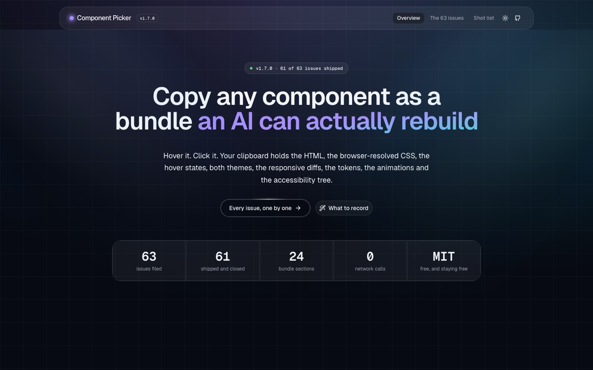
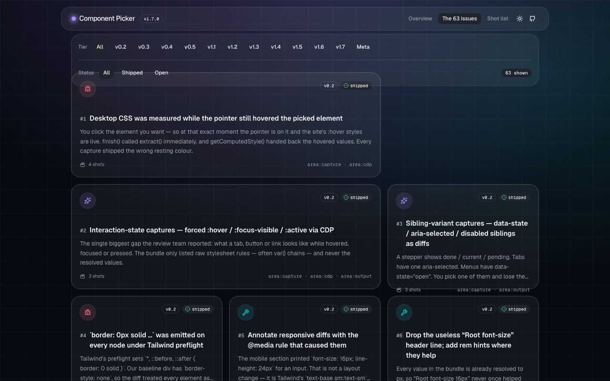
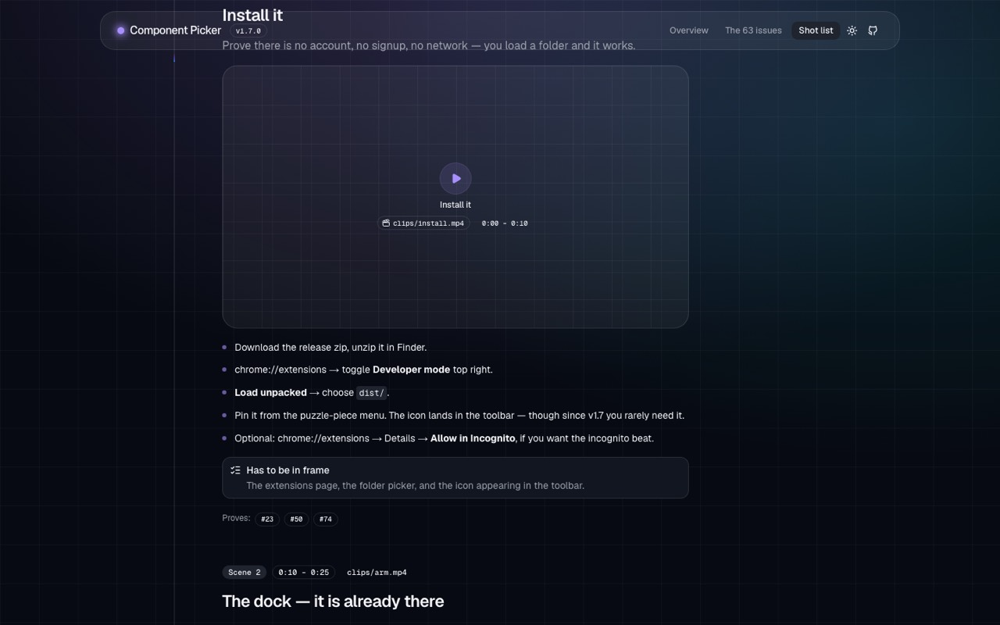

# Component Picker — site

The public site for the extension: what it captures, every issue that built it, and the shot
list for the demo video.



```sh
npm install
npm run dev     # http://localhost:3000
npm run build   # 69 static pages
```

## Routes

| Route | What it is |
|---|---|
| `/` | Hero, the bento of what one capture contains, the milestone timeline |
| `/issues` | All 63 issues, filterable by milestone and status |
| `/issues/[n]` | One issue: what was wrong, the acceptance criterion, its video slot, its shot list |
| `/record` | The full shot list — 12 scenes, the setup checklist, and every clip filename |

 

## Adding the videos

Every video slot resolves in three states, checked at build time:

1. `public/clips/<id>.mp4` exists → the video, using the still as its poster.
2. A `still` was passed → the real screenshot, captioned *clip pending*.
3. Neither → the shot list for that clip.

A missing file is never an error. The filenames:

```
public/clips/hero-loop.mp4     # the 15s silent loop at the top of /
public/clips/<scene-id>.mp4    # one per scene on /record (install, arm, hover, …)
public/clips/issue-<n>.mp4     # optional, per issue page
```

`/record` lists every filename the site is waiting for, in order. `public/shots/` holds the
stills — `dock.png` and `popup.png` are the real Web Store screenshots from `store/assets/`.

## Data

Everything on the site comes from two files, so the content lives in one place and the counts are
never typed twice:

- `src/data/issues.ts` — the milestones and all 63 issues, each with the reason it was filed, its
  acceptance criterion, and what to film for it.
- `src/data/scenes.ts` — the recording setup, the hero loop, and the 12 scenes.
- `src/data/types.ts` — `VERSION`, in exactly one place.

The hero badge, the stat row, the nav label and the "still open" list all read the arrays. When a
milestone ships, edit the data — nothing else.

## Stack

Next.js 16 (App Router, Turbopack) · Tailwind v4 · shadcn/ui on Base UI · Aceternity UI
(bento grid, spotlight, timeline, tracing beam, glowing effect, container scroll, background
beams) · `next-themes` for light/dark. Every component comes from a registry; the registry
components were re-themed to semantic tokens rather than overridden at the call site, and the
palette is defined once in `src/app/globals.css`.
